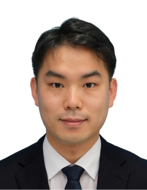

# Professor / 교수 소개

{: width="170" style="float:right; margin: 0 0 1rem 1rem; border-radius:24px;" }

한양대학교 도시대학원의 엄선용 교수는 도시공학 및 데이터 사이언스 분야의 전문가로서,  
**지속가능한 도시 구조**, **인간의 이동성 및 접근성**, **재해에 강한 도시 계획**에 대한 연구를 수행하고 있습니다.  

이를 위해 도시수리모델, 도시리스크개론, 도시 및 부동산 정보 분석 등 **공간계획을 위한 이론과 방법론**에 대한 깊은 이해를 바탕으로 학문적 지도를 제공하고 있습니다.  

한양대학교에서 학사와 석사 학위를, 일본 츠쿠바대학교에서 박사 학위를 취득한 후, 일본 토요타도시교통연구소, 도쿄대학교 공간정보과학센터, 츠쿠바대학교에서 연구와 교육 활동을 이어왔습니다.  

“**Diagnosing Cities from Data, Inventing a Better Future**”라는 슬로건 아래,  
도시를 복잡하고 거대한 시스템으로서 데이터를 통해 이해하고,  
지속가능하며 행복한 도시를 만들기 위한 정책 결정에 필요한 **정량적 증거와 실질적 해결책**을 제시하는 데 큰 관심을 가지고 있습니다.

Associate Professor **Sunyong Eom** at the Graduate School of Urban Science, Hanyang University,  
is an expert in urban engineering and data science. He conducts research on sustainable urban structures,  
human mobility and accessibility, and disaster-resilient urban planning. His academic guidance is grounded  
in a deep understanding of urban mathematical models, urban risk fundamentals, and the analysis of urban and  
real estate information.  

After earning his bachelor's and master's degrees from Hanyang University and a Ph.D. in Risk Engineering  
from the University of Tsukuba, he continued research and teaching at the Toyota Transportation Research Institute,  
the Center for Spatial Information Science at the University of Tokyo, and the University of Tsukuba.  

Under the slogan *“Diagnosing Cities from Data, Inventing a Better Future,”* he aims to understand cities as  
complex, large-scale systems through data and to provide evidence and solutions for sustainable and happy cities.

---

## Affiliation & Profile / 소속 및 프로필

- **Affiliation**  
  Associate Professor, Graduate School of Urban Science, Hanyang University, Seoul, Korea  
  한양대학교 도시대학원 부교수, HYU Urban Land Use Lab Director

- **Office (연구실 위치)**  
  신소재공학관 626호  

- **Contact**  
  - Email: sunyongeom@hanyang.ac.kr  
  - Google Scholar: [Google Scholar Profile](https://scholar.google.com/citations?user=lIETjGEAAAAJ&hl=ja)

---

## Research Interests / 연구 관심 분야

- Geographic Information System (GIS) / 지리정보시스템  
- Urban Planning / 도시계획  
- Land Use / 토지이용  
- Urban Analysis / 도시해석  

---

## 학력 Education

- **Apr. 2013 – Mar. 2018**  
  Risk Engineering, Graduate School of Systems and Information Engineering, University of Tsukuba  
  일본 츠쿠바대학교 시스템정보공학연구과 리스크공학전공, 박사(공학)  
  · 논문제목: *용도 간의 상호관계·혼합도에 주목한 토지이용구조의 정량화와 평가에 관한 연구*  
  · Dissertation Title: *A Study on Quantification and Evaluation of Land-use Structure  
    Focusing on Interaction and Mixture Between Land-use Categories*

- **Mar. 2010 – Feb. 2012**  
  Department of Urban Planning, Graduate School, Hanyang University  
  한양대학교 일반대학원 도시공학과, 공학석사  
  · 논문제목: *대학 주변지역의 토지이용 특성에 따른 관리방안에 관한 연구*  
  · Dissertation Title: *A Study on Management Plan Based on Characteristics of Land Use  
    in Surrounding Area of University*

- **Mar. 2004 – Feb. 2010**  
  Department of Urban Planning and Engineering, College of Engineering, Hanyang University  
  한양대학교 공과대학 도시공학과, 공학사(졸업우수)

---

## 연구 및 교육경력 Professional Appointment

- **Jan. 2025 – Present**  
  Associate Professor, Graduate School of Urban Science, Hanyang University  

- **Apr. 2023 – Aug. 2024**  
  Associate Professor, Faculty of Engineering, Information and Systems, University of Tsukuba  

- **Jun. 2021 – Mar. 2023**  
  Assistant Professor, Faculty of Engineering, Information and Systems, University of Tsukuba  

- **Nov. 2020 – Mar. 2022**  
  Shibaura Institute of Technology (Teaching / Research appointment)  

- **Nov. 2020 – Jun. 2021**  
  University of Tsukuba (Research appointment)  

- **Mar. 2019 – Jun. 2021**  
  Center for Spatial Information Science, The University of Tokyo – Project / Visiting Researcher  

- **Apr. 2018 – Mar. 2019**  
  Engineer / Researcher, Toyota Transportation Research Institute  

---
## Professor Publications / 교수 논문

### ■ 국제 저널 (SCIE, SSCI, Peer-reviewed)

- S. Eom, H. Kim, D. Hasegawa, and I. Yamada,  
  “Pedestrian movement with large-scale GPS records and transit-oriented development attributes,”  
  **Sustainable Cities and Society**, Vol. 102, 105223, January 2024. *(SCIE)*

- H. Sung and S. Eom,  
  “Evaluating transit-oriented new town development: Insights from Seoul and Tokyo,”  
  **Habitat International**, Vol. 144, 120996, January 2024. *(SSCI)*

- S. Eom, M. Umemoto, and T. Suzuki,  
  “Cross-border evacuation and intermunicipal cooperation during large-scale flood disasters,”  
  **International Journal of Disaster Risk Reduction**, Vol. 79, 103159, July 2022. *(SCIE, 일본 요미우리신문 보도 2022.9.5)*

- L. Yang, S. Eom, and T. Suzuki,  
  “Measuring railway network performance considering accessibility levels in cities worldwide,”  
  **Journal of Transport Geography**, Vol. 96, 103211, October 2021. *(SSCI, Corresponding author)*

- S. Eom, M. Jang, and N.-S. Ji,  
  “Human Mobility Change Pattern and Influencing Factors during COVID-19, from the Outbreak to the Deceleration Stage: A Study of Seoul Metropolitan City,”  
  **The Professional Geographer**, Vol. 74, No.1, pp. 1–15, September 2021. *(SSCI)*

- K. Matsumoto, Y. Nakamine, S. Eom, and H. Kato,  
  “Demographic, social, economic, and regional factors affecting the diffusion of hybrid electric vehicles in Japan,”  
  **Energies**, Vol. 14, No.8, April 2021. *(SCIE)*

- S. Eom and Y. Nishihori,  
  “How weather and special events affect pedestrian activities: Volume, space, and time,”  
  **International Journal of Sustainable Transportation**, Vol. 16, No.5, pp. 462–475, March 2021. *(SSCI)*

- H. Chang, D.J. Yu, S.A. Markolf, C. Hong, S. Eom, W. Song, and D. Bae,  
  “Understanding Urban Flood Resilience in the Anthropocene: A Social-Ecological-Technological Systems (SETS) Learning Framework,”  
  **Annals of the American Association of Geographers**, Vol. 111, No.3, pp. 837–857, January 2021. *(SSCI)*

- S. Eom, T. Suzuki, and M.H. Lee,  
  “A land-use mix allocation model considering adjacency, intensity, and proximity,”  
  **International Journal of Geographical Information Science**, Vol. 34, No.5, pp. 899–923, November 2019. *(SCIE)*

---

### ■ 국제 저널 (기타, Peer-reviewed)

- Y. Huang, S. Eom, and T. Suzuki,  
  “Preference-based jogging route selection in downtown Tokyo,”  
  **Cities & Health**, 1–15, February 2024. *(SCOPUS, Corresponding author)*

- S. Eom and Y. Nishihori,  
  “Investigation on Visiting Pattern Change in Commercial Areas during COVID-19: A Case Study of 21 Cities in Japan,”  
  **ISPRS Annals of the Photogrammetry, Remote Sensing and Spatial Information Sciences**, Vol. V-4-2022, pp. 41–48, May 2022. *(SCOPUS)*

- H. Chang, S. Eom, Y. Makido, and D. Bae,  
  “Landscape and meteorological factors affecting flood damage in South Korea: A spatial approach,”  
  **Journal of Extreme Events**, 215001, pp. 1–23, April 2021.

- S. Eom and T. Suzuki,  
  “Spatial distribution of pedestrian space in central Tokyo,”  
  **International Review for Spatial Planning and Sustainable Development**, Vol. 7, No.2, pp. 108–124, April 2019. *(SCOPUS)*

---

### ■ 한국 및 일본 국내 저널 (Peer-reviewed)

- S. Eom, H. Yeo, and E. Byun,  
  “Facility Resources Allocation Model Response to Spread of Infectious Diseases: Focusing on COVID-19 Isolation Facilities,”  
  **Journal of Korea Planning Association**, Vol. 58, No.5, pp. 77–88, October 2023.

- 嚴先鏞，長谷川大輔：  
  人口変動を考慮した拠点計画手法に基づいた将来の拠点配置戦略の検討，  
  **都市計画論文集**, Vol. 58, No.3, pp. 585–591, 2023.10.

- 西堀泰英，嚴先鏞：  
  新型コロナウィルス感染拡大前後の商業集積地滞在人口の変化とその要因分析，  
  **土木学会論文集**, Vol. 79, No.6, 2023.4.

- 長谷川大輔，嚴先鏞，西堀泰英：  
  コロナ禍における商業集積地の公共交通のアクセシビリティの変化との滞在人口との関係  
  (코로나 기간에 있어서 상업집적지의 대중교통 접근성 변화 및 체재인구와의 관계),  
  **都市計画論文集**, Vol. 57, No.3, 2022.10.

- 佐野雅人，嚴先鏞，鈴木勉：  
  越境施設利用からみた隣接自治体依存構造の空間分析  
  (도시지역 간 연계시설 이용에서 본 인접 지자체 의존 구조의 공간분석),  
  **都市計画論文集**, Vol. 57, No.3, 2022.10.

- 榎本俊祐，嚴先鏞，鈴木勉：  
  人口密度分布に対応した都市拠点と公共交通路線の同時最適配置モデル分析  
  (인구밀도분포에 대응한 도시거점과 대중교통노선의 동시 최적 배치 모델 분석),  
  **都市計画論文集**, Vol. 57, No.2, 2022.10.

- 西堀泰英，加藤秀樹，嚴先鏞，豊木博泰，佐々木邦明：  
  Wi-Fi パケットセンサーデータを用いたコロナ禍における中心市街地の人々の活動分析  
  (Wi-Fi 패킷센서 데이터를 이용한 코로나 기간 중 중심시가지 사람들의 활동 분석),  
  **交通工学論文集**, Vol. 8, No.2, pp. B_53–B_62, 2022.8.

- 西堀泰英，嚴先鏞，佐々木邦明，加藤秀樹：  
  交通ビッグデータを用いた地方都市中心市街地の人出等に対するCOVID-19感染拡大防止対策の影響分析  
  (교통빅데이터를 이용한 지방도시 중심시가지의 유동인구 등에 대한 COVID-19 감염확대방지대책의 영향 분석),  
  **都市計画論文集**, Vol. 56, No.3, pp. 834–841, 2021.10.

- 長谷川大輔，嚴先鏞：  
  ダイヤの接続性を考慮した地域公共交通網の性能評価手法に関する研究  
  (운행시간표의 연결성을 고려한 지역 대중교통망의 성능평가방법에 관한 연구),  
  **都市計画論文集**, Vol. 56, No.3, pp. 532–538, 2021.10.

- 定梶圭，嚴先鏞，鈴木勉：  
  施設集積に基づいた鉄道駅の類型化と拠点性に関する研究  
  (시설집적에 기초한 철도역의 유형화와 거점성에 관한 연구),  
  **都市計画論文集**, Vol. 56, No.2, pp. 397–402, 2021.10.

- 송혜승, 엄선용:  
  “생활인프라 도보거점배치모델 구축과 평가: 서울시 도봉구를 대상으로,”  
  **국토계획**, Vol. 56, No.4, pp. 74–87, 2021.8.

- 西堀泰英，嚴先鏞：  
  中山間地における自動運転に対応した道路空間整備延長の分析  
  ～整備優先順位設定手法の検討～  
  (중산간지역에서의 자동 운전에 대응한 도로 공간 정비 연장의 분석 – 정비 우선 순위 설정 수법의 검토),  
  **土木学会論文集D3（土木計画学）**, Vol. 76, No.5, pp. I_937–I_944, 2021.4.

- 嚴先鏞，長谷川大輔：  
  日常生活における施設利用時の複数施設利用を考慮した拠点配置と自治体の利便性評価  
  (일상 생활에서 시설 이용 시 복수 시설 이용을 고려한 거점 배치와 지자체의 편의성 평가),  
  **都市計画論文集**, Vol. 55, No.3, pp. 1078–1085, 2020.10.

- 佐野雅人，嚴先鏞，鈴木勉：  
  都市拠点設計への応用のための全国自治体の地域施設配置比較評価  
  (도시 거점 설계에 응용을 위한 전국 지자체의 지역 시설 배치 비교 평가),  
  **都市計画論文集**, Vol. 55, No.3, pp. 1086–1091, 2020.10.

- 榎本俊祐，嚴先鏞，鈴木勉：  
  公共交通運賃の空間構造と公共交通優位地域の空間的評価  
  (대중교통 운임의 공간구조와 대중교통 우위지역의 공간적 평가),  
  **都市計画論文集**, Vol. 55, No.3, pp. 1227–1232, 2020.10.

- 西堀泰英，嚴先鏞：  
  中心市街地における駐車場利用実態データを活用した利用者の活動分析  
  (중심 시가지의 주차장 이용 실태 데이터를 활용한 이용자의 활동 분석),  
  **交通工学論文集**, Vol. 6, No.2, pp. B_46–B_53, 2020.2.

- 嚴先鏞，西堀泰英，坪井志朗：  
  複数の施設の集約を考慮した利便性の評価と公共交通利用者の不便の要因に関する研究  
  (복수 시설의 집약을 고려한 편의성 평가와 대중교통 이용자의 불편 요인에 관한 연구),  
  **都市計画論文集**, Vol. 54, No.3, pp. 1549–1555, 2019.10.

- 嚴先鏞，山村拓巳，鈴木勉：  
  立地合致度指標を用いた公共施設立地の商業集積との空間적関係に関する研究  
  (입지 일치도 지표를 이용한 공공 시설 입지의 상업 집적과의 공간적 관계에 관한 연구),  
  **都市計画論文集**, Vol. 53, No.3, pp. 1442–1447, 2018.10.

- 嚴先鏞，鈴木勉：  
  東京区部における用途地域区分別の土地利用構成比と混合度の変化に関する研究  
  (도쿄 구부의 용도지역 구분별 토지이용 구성비와 혼합도 변화에 관한 연구),  
  **都市計画論文集**, Vol. 53, No.2, pp. 116–123, 2018.10.

- 若林建吾，嚴先鏞，鈴木勉：  
  東京区部における建物指標と道路指標を考慮した市街地分類に関する研究  
  (도쿄 구부의 건물 지표와 도로 지표를 고려한 시가지 분류에 관한 연구),  
  **都市計画論文集**, Vol. 52, No.3, pp. 711–716, 2017.10.

- 嚴先鏞，鈴木勉：  
  空間的土地利用混合度指標を用いた住宅地地価分析による土地利用パターンの評価  
  (공간적 토지 이용 혼합도 지표를 이용한 주택지 지가 분석을 통한 토지이용 패턴 평가),  
  **都市計画論文集**, Vol. 52, No.3, pp. 1356–1363, 2017.10.

- 嚴先鏞，鈴木勉：  
  用途間の隣接性，集積性，近接性の観点から見た混合土地利用パターンの定量化  
  (용도 간 인접성·집적성·근접성 관점에서 본 혼합 토지이용 패턴의 정량화),  
  **都市計画論文集**, Vol. 51, No.3, pp. 867–874, 2016.10.

- 곽은미, 엄선용, 이명훈:  
  “토지이용패턴 특성이 통행발생량에 미치는 영향에 관한 연구 – 서울시를 중심으로 –,”  
  **국토계획**, Vol. 48, No.5, pp. 7–21, 2013.10.

- 김수연, 엄선용, 이명훈:  
  “토지이용특성별 서울시 역세권의 범위 설정에 관한 연구,”  
  **국토계획**, Vol. 48, No.1, pp. 23–37, 2013.2.

- 엄선용, 김수연, 안근철, 이명훈:  
  “대학 주변지역의 토지이용 특성에 따른 관리방안에 관한 연구 – 토지이용 용도와 개발밀도 특성을 중심으로 –,”  
  **국토계획**, Vol. 47, No.1, pp. 45–55, 2012.2.

- 엄선용, 송옥희, 이명훈:  
  “지속가능한 도시 개발을 위한 친환경 건축물 인증제도의 개선 방안에 관한 연구 – 도시계획적 요소를 중심으로 –,”  
  **국토계획**, Vol. 47, No.1, pp. 19–31, 2012.2.

---

## Awards / 수상

- **Feb. 2021** – 2020年度 シンフォニカ 統計GIS活動奨励賞, 통계정보연구개발센터  
- **Oct. 2020** – Poster Session Award, GIS Association of Japan (2회)  
- **Mar. 2018** – 리스크공학전공장상(교육·사회공헌 부문), University of Tsukuba  
- **Oct. 2011** – 대한국토·도시계획학회 2011년 추계학술대회 최우수논문상  

---

## Professional Memberships / 학회 활동

- Korean Planning Association  
- The Operations Research Society of Japan  
- Architectural Institute of Japan  
- Geographic Information Systems Association of Japan  
- The City Planning Institute of Japan  

---

## Research Projects / 주요 연구과제

- 「計画的な相互融通」による災害時応急対応上の周辺自治体間連携の効果と適正スケール  
  (재해 시 응급 대응을 위한 자치단체 간 상호 연계 효과와 적정 스케일에 관한 연구),  
  JSPS Grants-in-Aid for Scientific Research (B), 2024–2028.

- Urban Structure Design for Climate Change Adaptation and Mitigation Using Transportation Big Data,  
  JSPS Grants-in-Aid for Early-Career Scientists, 2023–2025.

- Mathematical Model for Effective Intermunicipal Cooperation Regarding Daily and Emergency Facility Usage,  
  Hirose Foundation, 2022–2024.

- Development of Planning Support Method for Improving Accessibility by Connecting Land Use, Facility,  
  and Public Transportation, JSPS Grants-in-Aid for Early-Career Scientists, 2019–2023.

- A Study for Clarifying the Desirable Land-use Pattern by Combining Various Spatial Data, 2020–2021.
